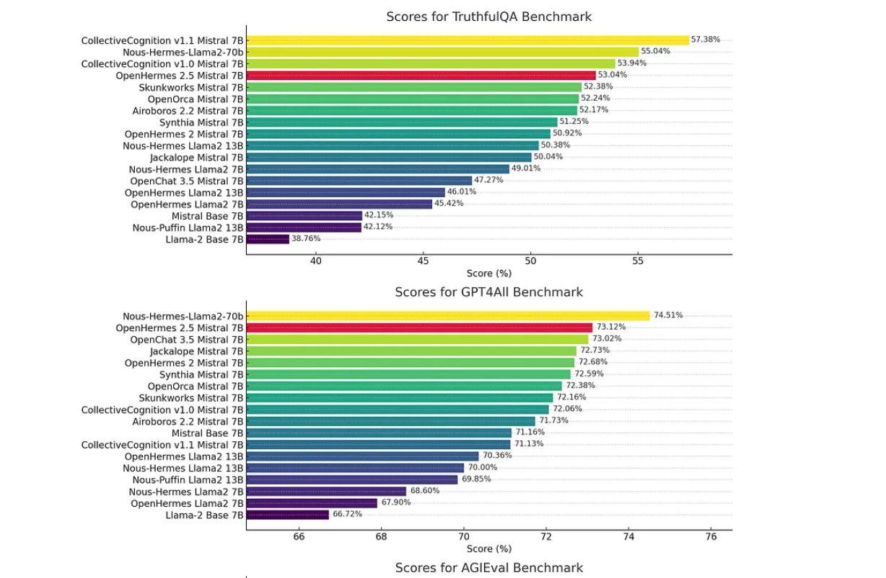

# Matkhafich

## Description

Matkhafich is an AI-driven chatbot assistant designed to support women in Morocco who suffer from violence. This project aims to provide a confidential and accessible platform where women can seek information, receive psychological support, and understand their legal rights without the fear of judgment or shame.

- **Motivation:** The persistent issue of violence against women in Morocco, coupled with the cultural stigma that prevents victims from speaking out, motivated us to create a solution that offers privacy and support.
- **Why:** We built this project to empower women with the knowledge and support they need to take action against violence, in a discreet and non-judgmental manner.
- **Problem Solved:** Matkhafich addresses the lack of accessible and confidential resources for women facing violence, providing them with legal information and psychological support.
- **What We Learned:** Through this project, We learned which LLM (Large Language Model) works well with RAG (Retrieval-Augmented Generation) when using French documents. We also familiarized ourselves with Hugging Face Spaces, which we had not worked with before. Additionally, we learned how to perform effective prompt engineering and understood how it affects the responses of the model.

## GenAI Challenge Path
Empowerment and Safety for Moroccan Women

## Trained Models
We initially tried using Mistral-7B, but it gave us responses in English and did not support French adequately. Therefore, we switched to guillaumetell-7b, a French Large Language Model (LLM) based on OpenHermes-2.5-Mistral-7B, optimized for RAG (Retrieval Augmented Generation) with source traceability and explainability.

## Evaluation Protocol and Benchmarking
The evaluation of guillaumetell-7b is based on its underlying model OpenHermes-2.5-Mistral-7B. 
OpenHermes beats the majority of other 13B and 7B models on various benchmarks, such as TruthfulQA, GPT4All, and AGIEval.

Have a quick look at the results yourself:



## Table of Contents

- [Installation](#installation)
- [Usage](#usage)
- [Demo](#demo)
- [Credits](#credits)
- [Features](#features)

## Installation

To install and run Matkhafich locally, follow these steps:

1. Clone the repository:
    ```bash
    git clone https://github.com/Shaima-BenJaafar/Matkhafich.git
    ```
2. Navigate to the project directory:
    ```bash
    cd matkhafich
    ```
3. Install the required dependencies:
    ```bash
    pip install -r requirements.txt
    ```

## Usage

To use Matkhafich, simply run the application and interact with the chatbot through the user interface. The chatbot will guide you through various options, including legal information, advice, and psychological support.

## Demo

Watch the demo video to see Matkhafich in action:


## Credits

- **Team Members:**
  - [M'RHAR Kaoutar](https://www.linkedin.com/in/kaoutar-m%E2%80%99rhar-9051b7234/)
  - [BEN JAAFAR Chaima](https://www.linkedin.com/in/chaima-ben-jaafar-103481277/)

- **Acknowledgements:**
  - Government of Morocco for providing access to legal documents

## Features

- Confidential chat interface for women facing violence
- Legal information retrieval based on Moroccan laws
- Psychological support and advice

